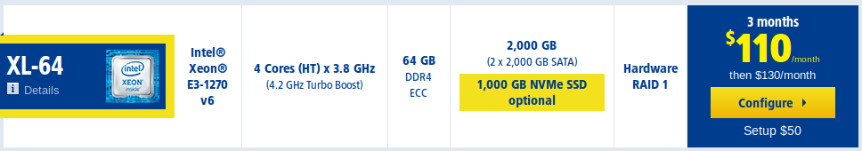
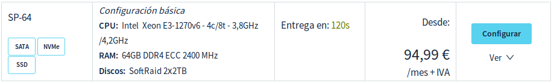
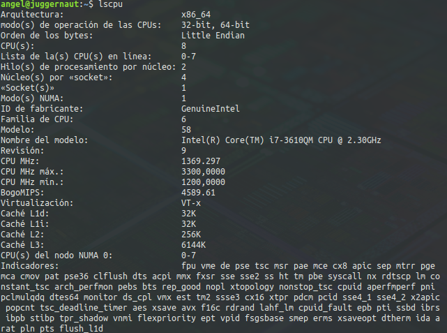
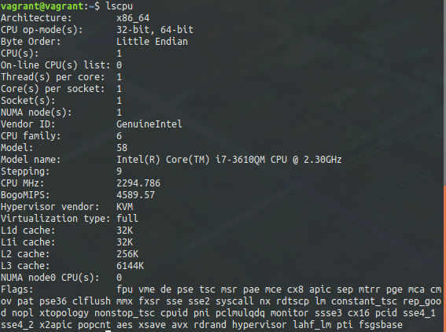
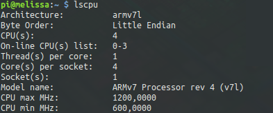
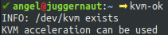
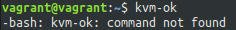
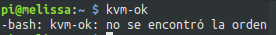
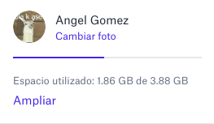

# Introducción: Concepto y soporte físico

## 1

Según esta [tabla de amortización](https://www.agenciatributaria.es/AEAT.internet/Inicio/Ayuda/Manuales__Folletos_y_Videos/Manuales_practicos/_Ayuda_Folleto_Actividades_economicas/3__Impuesto_sobre_la_Renta_de_las_Personas_Fisicas/3_5_Estimacion_directa_simplificada/3_5_4__Tabla_de_amortizacion_simplificada/3_5_4__Tabla_de_amortizacion_simplificada.html) de la Agencia Tributaria, el coeficiente lineal máximo de amortización anual es del 26%, y el máximo de años es de 10. La amortización se hace sobre la base imponible.

Caso de ejemplo:

​	Dell PowerEdge T330 Intel Xeon V6 E3-1220/8GB/300GB

​	Precio: 1229€

​	Sin iva: 1015,72€

Primer supuesto: Amortización a 4 años (25% anual).

| Año  | € Acumulados | € Restantes |
| :--: | :----------: | :---------: |
|  1   |    253,93    |   761,79    |
|  2   |    507,86    |   507,86    |
|  3   |    761,79    |   761,79    |
|  4   |   1015,72    |      0      |

Primer supuesto: Amortización a 7 años (14,29% anual).

| Año  | € Acumulados | € Restantes |
| :--: | :----------: | :---------: |
|  1   |    145,15    |    870,9    |
|  2   |    290,3     |   725,75    |
|  3   |    435,45    |    580,6    |
|  4   |    580,6     |   435,45    |
|  5   |    725,75    |    290,3    |
|  6   |    870,9     |   145,15    |
|  7   |   1015,72    |      0      |

## 2

Ambos VPS ofrecen el mismo procesador, misma ram y misma configuración de disco.

### VPS en 1&1

- Coste de configuración: $50
- Coste/mes los tres primeros meses: $110
- Coste/mes los nueve meses restantes: $130

Total: $1550 ~ 1333,74€

### VPS en OVH

- Coste de configuración: 0€
- Coste/mes: 94,99€

Total: 1139,88€

## 3

### Portatil

### Máquina virtual

### Raspberry Pi 3B

## 4

### Portatil

### Máquina virtual

### Raspberry Pi 3B

## 5 y 6

Utilizo Dropbox como servicio de almacenamiento en la nube desde hace bastantes años. Lo uso como respaldo de todos mis prácticas y trabajos en la universidad. He ido obteniendo más almacenamiento con cupones gratuitos.

Para contenedores utilizo Docker ([mi perfil en hub.docker.com](https://hub.docker.com/u/harvestcore). Por otro lado también tengo cuenta en Heroku y en Microsoft Azure, gracias a un cupón gratuito que nos proporcionó [JJ](https://github.com/jj).

