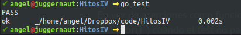
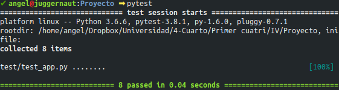
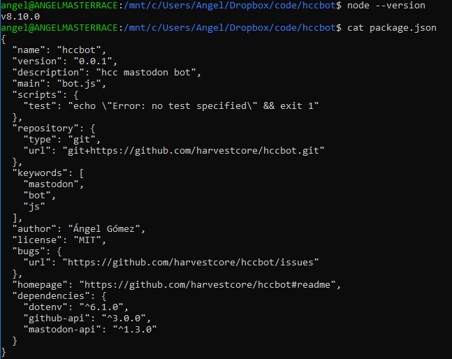

# Desarrollo basado en pruebas

## 1

He probado los tests en Go:




Por otro lado, para probar los tests en Python, he creado varios tests para mi proyecto ([IPContainer](https://github.com/harvestcore/IPContainer)), que además me sirven para completar el hito 2 de la asignatura. [Aquí está el link](https://github.com/harvestcore/IPContainer/blob/master/test/test_app.py) al archivo que los contiene y a continuación una prueba de ejecución:




## 2

```python
    def test_elimina_usuario_que_no_existe(self):
        self.assertEqual(self.ipc.removeUser("test_user5"), False, "No elimina usuario que no existe.")

    def test_crea_red_que_ya_existe(self):
        self.assertEqual(self.ipc.createNetwork("test_user1", "dns"), False, "Red existente no creada")
```

Los tests anteriores comprueban que en caso de eliminar un usuario que no existe o crear una red ya existente se obtiene valor False. Por lo tanto estas funciones fallan (porque no se puede realizar lo que se pide y retornan False), pero los tests pasan porque era lo esperado.


## 3

He creado dos scripts de Python que ejecutan los tests de mi microservicio. El primero comprueba las funcionalidades del mismo y el segundo los despliegues web.

- [Test class](https://github.com/harvestcore/IPContainer/blob/master/test/test_app_1_class.py)
- [Test web](https://github.com/harvestcore/IPContainer/blob/master/test/test_app_2_api.py)


## 4

He instalado la versión más actual (hasta la fecha) de node.js. El archivo *package.json* corresponde a un proyecto que estoy creando (un bot de Mastodon).



